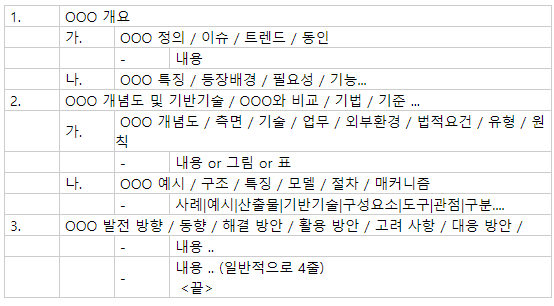

   

## 간글(십자형사고법)
> 채점자에게 내가 전달하고자 하는 내용을 함축 및 강조하는 역할
> 

x축 : 
- 융합(연계) : 같은레벨의 토픽과 주제, 연관관계 설정
- 실무(현실) : 방안, 전략
   
   
y축 : 
- 확장(넓게) : 상위토픽 및 주제, 스펙트럼 확장
- 심화(깊게) : 상세기술, 구성요소

## 1교시(용어형 - 오브젝트에 대한 설명)

> 정의 서술이 가장 중요하다고 할수있다
>
> 기술에 대한 key와 기술요소에 자신이 있다면 2번 포맷으로. 1번은 공통

### 1번포맷
- 답안의 횡과 종
종 - 답안의 논리적흐름
횡 - 지식의 양

- GRITA 스타일
1. ~   
**가.** 정의   
**나.** 부각이유, 필요성

2. ~   
**가.** 구성도   
**나.** 구성요소
	- (표) :  항목당 2줄   
	- '-' : 간글(2줄)
	// 총 11줄을 소비
	

- 템플릿
;
[출처-K씨's 쪼꼬렛팩토리](https://m.blog.naver.com/PostView.nhn?blogId=renucs&logNo=176168293&proxyReferer=https:%2F%2Fwww.google.com%2F)

;
;
;

### 2번포맷

문) 기술요소및 서비스 요소를 서술하시오

1. **(도입부)**   
**그림**(3줄)   
**글**(2줄)   

// 정의는 1단락에 반드시 들어가야한다. 표밑에 간글로 정의를 제시하는것이 괜찮음

2. **(물어본 질문에 대하여 기술하는 단락)**   
	**가.**   
	**나.**   

//가.나. 모두 간글 한개로 내가 표현하고싶은 내용을 함축하여 표한한다. 

## 2교시 (서술형, 논술형 - 나의 생각으로 채점자를 설득시킨다)

### 2교시 목차만들기
1. 목차는 답안의 흐름을 좌우
- 답안의 시작 목차
- 질문의 개수 - 대목차
- 대목차 - 질문에 출실
- 소목차 
	- (가):창의적 (나):충실
	
   
2. **목차는 3단락부터**

3. 1단락은 개념/확산/융합/한정/이슈/문제
- 서술문제의 서술부분과 질문과의 관계
	- 서술 : 소프트웨어진흥법개정안 전면통과
	- 질문 : 1.SRS의 중요성과 역할 2. SRS중심의 공공사업관리를 위한 이행방안
	- 접미어 - 상관관계, 주요내용등 **// 창작의 영역**
	
	
### 타입1(공통서술)

> 목차는 완성된 문장으로 기술한다. 목차의 비중이 50% 
> 논리의 전개순서 생각

**문) 개인정보인증과 관련된 구성 ,절차 및 기술구성요소에 대하여 서술**

1. (프롤로그)   
가. 2줄)정의   
나. 6줄)등장배경   
<2교시는 단락별 1줄을 띄어주어야한다>	

2. ~   
가. 그림→설명, 설명→그림 // 2단락 시작시 남아있는 줄수에 따라 가변적   
나. 절차   
    <표> // Header : |절차 | 액티비티 | 산출물 | // 컬럼의 흐름에 따라 진행되는구조   
<2교시는 단락별 1줄을 띄어주어야한다>	
3. ~      
가. 개념도   
나. 구성요소 // 점수에 반영되는 영역이다   
<2교시는 단락별 1줄을 띄어주어야한다>   	
**//	3단락 까지 25분 소비했다면 4단락은 스킵이 나음**
4. (에필로그)고려사항, 전망

### 타입2(공격적서술)

> 1~2문제는 공격적으로 서술한다. 그경우 자신이 펼치고싶은 논리구조에 대한 도식화 제시가 필요하다
> 프롤로그를 짧게(가.나.단락없음), 2,3단락을 풍부하게 서술

**문) S/W 역량강화**

1. (프롤로그)~ 취약이유    
	<표> 3줄 // 5줄 이상일 경우 끊어서 2개로 서술. 시작은 ()로 키워드를 표기   
	
2. ~ 파급효과 **// 1단락의 목차와 연계관계를 지녀야한다**   
가. 산업측면   
	<3단표> - 3번째컬럼은 키워드 기술   
나. 국가측면   
	
3. 하고싶은말   
가. 프로세스 도식화   
나. 세부활동 액티비트  **//3. 가.의 세분화**   
   
   
4. (에필로그)   
	방안 //간단히   
	
	